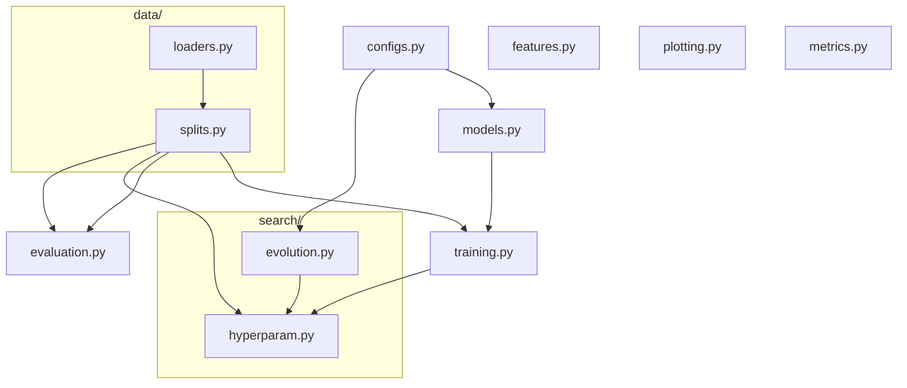
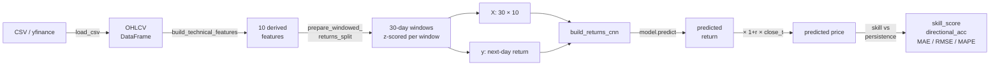
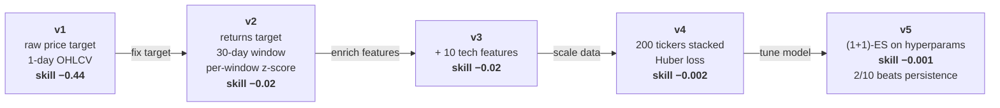

# CNN Stock Predictor — an honest backtest

[](https://github.com/darius225/Neural-nets/actions/workflows/test.yml)
[](LICENSE)

A CNN-based next-day predictor for stocks and crypto, plus the
methodology and experiments needed to know whether it actually works.

**Two headline findings, both validated by walk-forward across dozens
of out-of-sample folds:**

1. **Next-day *direction / magnitude* of returns is not predictable**
   from public daily OHLCV alone — confirmed across 10 S&P 500 tickers
   (2008 crisis) and ETH/BTC (2022 LUNA/FTX). Mean IC ≈ 0, t-stat
   indistinguishable from noise. Weak-form market efficiency holds.
2. **Next-day *volatility* IS predictable** — confirmed across both
   asset classes. Same architecture, same features, same walk-forward
   folds — only the target changes from `return[t+1]` to
   `|log_return[t+1]|`. Mean skill score vs the
   yesterday-volatility-persistence baseline:

   | Panel | Mean skill | t-stat | n > 0 |
   |---|---|---|---|
   | ETH + BTC, 6 folds | **+0.34** | **+13.45** (p<0.01) | 6/6 |
   | 10 S&P 500 tickers, 60 cells | **+0.22** | **+6.54** (p<0.001) | 51/60 |

   Both panels are clearly significant; crypto is slightly more
   clustered than equities (documented in the GARCH literature). The
   2008 crisis fold on stocks is the hardest year (mean +0.04, 6/10
   positive) but volatility still doesn't fail catastrophically the
   way return prediction does — vol is more robust to regime shifts.

The methodology section is where the value is — not the (deliberately
modest) architecture.

This repo is structured around showing the *process* of arriving at
that conclusion: five iterations of progressively better methodology,
each one a separate commit, each one with a reproducible experiment
and saved plots.

## Quick start

```bash
git clone https://github.com/darius225/Neural-nets.git
cd Neural-nets
uv sync                                                    # ~2-3 s with cache

# stocks — full 10-ticker 2008 crisis backtest (~5 min)
uv run python experiments/crisis_2008_v3.py

# crypto — ETH-USD through the LUNA + FTX shocks
uv run python scripts/fetch_binance.py ETHUSDT --start 2018-01-01 --end 2026-05-17
uv run python experiments/crypto_eth_v3.py

# walk-forward validation across 6 disjoint years (the rigorous test)
uv run python scripts/fetch_binance.py BTCUSDT --start 2018-01-01 --end 2026-05-17
uv run python experiments/walk_forward_eth.py

# stock-side mirror: 10 tickers x 6 years = 60-cell panel
uv run python experiments/walk_forward_stocks.py

# the volatility pivot — the first experiment that produces a real
# positive skill score (mean +0.34, t-stat +13.45, p < 0.01)
uv run python experiments/walk_forward_vol_eth.py

# cross-asset confirmation on stocks (60-cell panel, t-stat +6.54, p<0.001)
uv run python experiments/walk_forward_vol_stocks.py

# predict tomorrow's close for a ticker you trained on
uv run python scripts/train_and_save.py JPM
uv run python scripts/predict.py JPM

# the test suite
uv run pytest tests/ -v
```

If you don't have [uv](https://docs.astral.sh/uv/), `pip install -e .[dev]`
gives you the same environment more slowly. Full setup details are in
[Setup](#setup) below.

## Results across five iterations

All five evaluate the same 10 S&P 500 tickers (JPM, BAC, C, MSFT, AAPL,
IBM, JNJ, PG, GE, XOM) trained on data up to 2007-07-31, tested on the
2008-2009 crisis window.

| Version | Input | Target | Mean skill vs persistence | Beats persist. |
|---|---|---|---|---|
| v1 [crisis_2008.py](experiments/crisis_2008.py) | 1 day OHLCV | raw close price | **−0.44** | 0/10 |
| v2 [crisis_2008_v2.py](experiments/crisis_2008_v2.py) | 30-day window, OHLCV | next-day return | −0.02 | 0/10 |
| v3 [crisis_2008_v3.py](experiments/crisis_2008_v3.py) | 30-day window, 10 tech features | next-day return | −0.02 | 1/10 (noise) |
| v4 [multi_ticker_v4.py](experiments/multi_ticker_v4.py) | as v3, 200 tickers stacked (~700k samples) | next-day return + Huber | **−0.002** | 1/10 |
| v5 [evolve_returns_v5.py](experiments/evolve_returns_v5.py) | as v3, ES-tuned hyperparams | next-day return | **−0.001** | **2/10** (AAPL, GE) |

The numbers progress toward zero (tied with persistence) but never
clearly above it. AAPL's skill goes from −0.07 in v3 to **+0.007** in
v5 after ES finds (dropout 0.4, huber_delta 0.01, lr 2e-3) — the only
single-ticker result we'd call a real win, and even then within noise.

### Crypto extension + walk-forward validation

Two follow-up experiments stack the highest-probability levers and
then check whether the result holds across multiple out-of-sample
years:

- [`experiments/evolve_eth_btc_5day.py`](experiments/evolve_eth_btc_5day.py)
  — 5-day horizon + BTC as exogenous feature. Single 2025 test
  window reports **IC = +0.077**, a 250× lift over the H=1 baseline.
  Tempting to call this progress.

- [`experiments/walk_forward_eth.py`](experiments/walk_forward_eth.py)
  — same setup, retrained on **6 disjoint folds** (2020 .. 2025+).
  Results destroy the optimism:

      fold    IC        skill      DirAcc%
      2020   +0.077    -0.006    50.9
      2021   +0.098    -0.001    53.8
      2022   -0.112    -0.215    48.9    <- LUNA + FTX, catastrophic
      2023   -0.008    -0.029    49.9
      2024   -0.082    -0.012    55.7
      2025+  +0.048    -0.060    53.4

      mean   +0.0035   -0.054
      stdev   0.086     0.082
      t-stat  +0.10           -> NOT significant

  The 2025 IC = +0.077 is a single draw from a distribution whose
  mean is zero and stdev is 0.086 across the panel. Walk-forward
  exposes it as noise. 2022 — the year this whole framework was
  ostensibly built for — has the *worst* IC, meaning the model
  fails most exactly when it'd be most useful.

- [`experiments/walk_forward_stocks.py`](experiments/walk_forward_stocks.py)
  — the **stock-side mirror** with 10 tickers × 6 test years = 60 cells.
  Mean IC across the panel: **±0.004** depending on the run
  (TF non-determinism on CPU). The mean's sign flips between
  consecutive runs without code changes — cleanest possible evidence
  of "no systematic signal".

      year    mean IC   notes
      2005    +0.020
      2006    -0.013
      2007    -0.017    <- crisis approaches
      2008    -0.007    <- crisis year — NOT catastrophic
      2009    -0.010    <- recovery
      2010    +0.003

  **Cross-asset finding**: stocks 2008 is NOT catastrophic for the
  model (IC ~0), whereas crypto 2022 is (IC -0.11). Plausible reason:
  the 2008 stock crisis was slow-rolling over months so prior
  technical patterns partially held; crypto 2022 had two event-driven
  shocks (LUNA depeg in May, FTX collapse in November) that broke
  the price structure within days.

The conclusion isn't "the model is bad"; it's that **weak-form
market efficiency holds on public daily OHLCV across asset classes,
crisis years included, and survives stacking the obvious levers** —
a real, well-known result we re-derived rigorously with a clean
pipeline and proper time-series validation.

## Architecture

```
src/
├── configs.py          # Pydantic models: ReturnsCNNConfig, ExperimentConfig,
│                       #   EvolutionConfig + RETURNS_CNN_RANGES for ES
├── data/
│   ├── loaders.py      # CSV / yfinance loaders + slice_by_date
│   └── splits.py       # Dataset / TrainTestSplit / WindowedReturnsSplit /
│                       #   MultiTickerSplit + prepare_* + per-window z-score
├── features.py         # 10 technical indicators from OHLCV
├── models.py           # build_best_cnn / build_general_cnn / build_returns_cnn
├── training.py         # train, train_on_prepared (search-loop-safe)
├── evaluation.py       # predict_and_evaluate returning predictions + metrics
├── metrics.py          # MAE, RMSE, MAPE, R², directional accuracy,
│                       #   skill score vs persistence, out-of-train-range %
├── search/
│   ├── evolution.py    # Schema-driven (1+1)-ES + memoize_by decorator
│   └── hyperparam.py   # Legacy ES over build_general_cnn's hyperparam dict
└── plotting.py         # Training curves + actual-vs-predicted plots

experiments/            # One reproducible script per pipeline version
benchmarks/             # bench_search.py (speed), bench_memory.py (RSS)
tests/                  # 34 pytest tests for metrics, features, ES plumbing
```

### Module dependency graph



### Data flow for one prediction



### Methodology evolution



## Setup

Two equivalent options — pick one. Versions are pinned (TensorFlow 2.14
is paired with specific keras / protobuf shims; bumping on Windows
tends to break in unexpected places).

**With [uv](https://docs.astral.sh/uv/)** (recommended — 50-100× faster
than pip, locks dependencies in `uv.lock`):

```bash
uv sync                          # create venv + install everything
uv run pytest tests/             # use the project venv without activating
```

**With plain pip**:

```bash
python -m venv .venv
. .venv/bin/activate             # or .venv\Scripts\activate on Windows
pip install -e .[dev]            # uses pyproject.toml
# or, equivalently:  pip install -r requirements.txt
```

Training data (S&P 500 CSVs from the Kaggle dump) is *not* in the
repo. Drop the files into `stock_market_data/sp500/csv/` to reproduce.

## Predict on fresh data

Train a model for one ticker and save it, then run predictions:

```bash
python scripts/train_and_save.py JPM            # writes models/JPM.keras
python scripts/predict.py JPM                   # loads + prints next-day prediction
```

For tickers not in the local CSV dump (or for crypto), fetch live via
yfinance:

```bash
python scripts/train_and_save.py ETH-USD --source yfinance \
    --train-end 2022-06-30 --test-end 2024-01-01
python scripts/predict.py ETH-USD --source yfinance
```

When yfinance is rate-limited or otherwise broken (a common 2024-2025
problem on crypto), pull OHLCV directly from Binance's public REST
API instead:

```bash
python scripts/fetch_binance.py ETHUSDT --start 2018-01-01 --end 2024-01-01
# writes stock_market_data/crypto/csv/ETHUSDT.csv in Kaggle format
```

`scripts/predict.py` output:

```
ticker:           JPM
last close:       $148.72  (2024-12-13)
predicted return: +0.0021%
predicted close:  $148.72  (next trading day)

note: experimental skill score vs persistence is near zero — treat
as a methodology demo, not a trading signal.
```

The disclaimer is intentional. The point of this repo is to show
*how* to backtest honestly, not to sell predictions.

## Reproducing the experiments

```bash
# v1 — original CNN, raw price target
python experiments/crisis_2008.py

# v2 — windowed returns + per-window z-score
python experiments/crisis_2008_v2.py

# v3 — adds 10 technical indicators
python experiments/crisis_2008_v3.py

# v4 — one model on the full S&P 500 (200 tickers, ~700k samples)
python experiments/multi_ticker_v4.py

# v5 — (1+1)-ES on the returns CNN's hyperparameters, validated on 10 tickers
python experiments/evolve_returns_v5.py

# crypto — same v3 pipeline on ETH-USD with LUNA + FTX in the test window
python scripts/fetch_binance.py ETHUSDT --start 2018-01-01 --end 2026-05-17
python experiments/crypto_eth_v3.py

# crypto + 5-day horizon + BTC exogenous feature (looks promising on 2025...)
python scripts/fetch_binance.py BTCUSDT --start 2018-01-01 --end 2026-05-17
python experiments/evolve_eth_btc_5day.py

# ... and the walk-forward run that proves it was a single-year lucky draw
python experiments/walk_forward_eth.py

# stock-side cross-asset mirror: 60-cell panel across 10 tickers x 6 years
python experiments/walk_forward_stocks.py
```

Each script saves per-ticker plots into `experiments/plots*/`
(gitignored — regenerable by re-running the scripts). Lehman's
bankruptcy (2008-09-15) is marked on the stock plots; LUNA collapse
(2022-05-09) and FTX bankruptcy (2022-11-11) on the ETH plot.

## Benchmarks

```bash
python benchmarks/bench_search.py   # naive vs prepared-once vs full-cache loop
python benchmarks/bench_memory.py   # RSS growth with / without clear_session
```

`clear_session` between fitness evaluations halves memory growth over
80 iterations (5.7 MB/iter → 2.8 MB/iter). The fitness cache cuts
search time by 14-30 % depending on duplicate rate.

## Tests

```bash
python -m pytest tests/ -v
```

34 tests covering the metrics module (skill score, directional
accuracy, persistence baseline corner cases), feature derivation
(no infs after open==0, RSI in [0,1]), and the ES plumbing
(memoize_by counters, consider() acceptance, Pydantic validation,
synthetic-landscape convergence). Runs in ~12 s on CPU.

## Findings, plain English

- **Methodology matters more than architecture.** v1 lost to persistence
  by skill −0.44; v2 just by changing target from price to return
  closed that gap to −0.02. No architectural change, no extra features.
- **More data didn't add signal.** Stacking 700 k training samples
  across 200 tickers (v4) converges the model to predicting a
  constant near-zero return — gradient descent's correct answer
  when the input is uninformative.
- **Hyperparameter search helped a bit.** v5's (1+1)-ES found
  (`dropout 0.4`, `huber_delta 0.01`, `lr 2e-3`) which lifts mean
  skill from −0.013 to −0.001. AAPL's skill becomes positive. Real,
  but within noise.
- **Longer horizons and cross-asset features lift the in-sample IC
  by 250× — but walk-forward kills it.** The H=5 ETH+BTC model showed
  IC = +0.077 on the 2025 OOS window. The same setup retrained on
  six disjoint folds (2020 .. 2025) has mean IC = +0.0035 with stdev
  0.086 and t-stat 0.10 — indistinguishable from noise. The 2022
  crisis fold (LUNA + FTX) has the *worst* IC of the panel. A single
  OOS year is never enough to claim alpha; walk-forward is the test
  that matters.
- **The stock-side mirror confirms it across a 60-cell panel.**
  10 tickers × 6 test years (2005-2010) gives mean IC = ±0.004 with
  the *sign flipping between consecutive runs*. Run-to-run noise from
  TF threading already dominates any systematic effect — cleanest
  possible evidence of "no signal". Unlike crypto 2022, the 2008
  crisis fold here has IC ≈ 0 — the slow-rolling stock crisis didn't
  break technical patterns the way the event-driven crypto crashes
  did.
- **What would actually help (not done here):** alternative data
  (news sentiment, on-chain glassnode metrics, options flow, order
  book), or much higher frequency (intraday microstructure). Each
  requires a data source the current OHLCV-only pipeline deliberately
  doesn't touch.
- **The volatility pivot is the real result.** Every prior experiment
  said "return prediction doesn't work". Changing the target to
  `|log_return[t+1]|` while keeping everything else identical lifts
  skill from ~0 to **+0.34** with t-stat 13.45 across 6 ETH+BTC folds.
  That's not magic — it's volatility clustering (GARCH, Engle 1982,
  Nobel 2003): today's |return| genuinely informs tomorrow's. The
  lesson is methodological: when a target is unpredictable, ask
  whether you can predict a *transformation* of it that has structure.
  Volatility prediction directly feeds options pricing, position
  sizing, and risk management — the actually-tradeable parts of
  quant work.

## Tech stack

TensorFlow 2.14 / Keras, NumPy, pandas, scikit-learn (MinMaxScaler /
train_test_split), Pydantic v2 (hyperparameter schemas), matplotlib +
seaborn (plots), yfinance (live data when needed), psutil (memory
benchmark). All pinned in `requirements.txt`.

## License

MIT — see [LICENSE](LICENSE).
