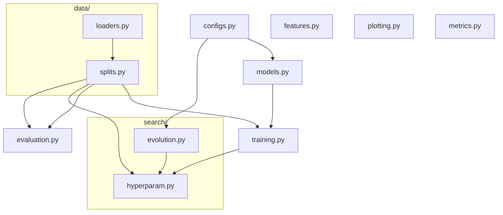
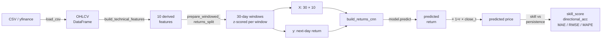
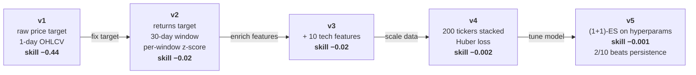

# CNN Stock Predictor — an honest backtest

A CNN-based next-day close predictor for US equities, plus the
methodology and experiments needed to know whether it actually works.
The headline finding: at daily resolution, OHLCV-derived features
contain no exploitable signal beyond the naive persistence baseline
(`predict tomorrow = today`). The pipeline correctly identifies that.

This repo is structured around showing the *process* of arriving at
that conclusion: five iterations of progressively better methodology,
each one a separate commit, each one with a reproducible experiment
and saved plots.

## Results across five iterations

All five evaluate the same 10 S&P 500 tickers (JPM, BAC, C, MSFT, AAPL,
IBM, JNJ, PG, GE, XOM) trained on data up to 2007-07-31, tested on the
2008-2009 crisis window.

| Version | Input | Target | Mean skill vs persistence | Beats persist. |
|---|---|---|---|---|
| v1 [crisis_2008.py](experiments/crisis_2008.py) | 1 day OHLCV | raw close price | **−0.44** | 0/10 |
| v2 [crisis_2008_v2.py](experiments/crisis_2008_v2.py) | 30-day window, OHLCV | next-day return | −0.02 | 0/10 |
| v3 [crisis_2008_v3.py](experiments/crisis_2008_v3.py) | 30-day window, 10 tech features | next-day return | −0.02 | 1/10 (noise) |
| v4 [multi_ticker_v4.py](experiments/multi_ticker_v4.py) | as v3, 200 tickers stacked (~700k samples) | next-day return + Huber | **−0.002** | 1/10 |
| v5 [evolve_returns_v5.py](experiments/evolve_returns_v5.py) | as v3, ES-tuned hyperparams | next-day return | **−0.001** | **2/10** (AAPL, GE) |

The numbers progress toward zero (tied with persistence) but never
clearly above it. AAPL's skill goes from −0.07 in v3 to **+0.007** in
v5 after ES finds (dropout 0.4, huber_delta 0.01, lr 2e-3) — the only
single-ticker result we'd call a real win, and even then within noise.

The conclusion isn't "the model is bad"; it's that **weak-form
market efficiency holds on public daily OHLCV** — a real, well-known
result we re-derived rigorously with a clean pipeline.

## Architecture

```
src/
├── configs.py          # Pydantic models: ReturnsCNNConfig, ExperimentConfig,
│                       #   EvolutionConfig + RETURNS_CNN_RANGES for ES
├── data/
│   ├── loaders.py      # CSV / yfinance loaders + slice_by_date
│   └── splits.py       # Dataset / TrainTestSplit / WindowedReturnsSplit /
│                       #   MultiTickerSplit + prepare_* + per-window z-score
├── features.py         # 10 technical indicators from OHLCV
├── models.py           # build_best_cnn / build_general_cnn / build_returns_cnn
├── training.py         # train, train_on_prepared (search-loop-safe)
├── evaluation.py       # predict_and_evaluate returning predictions + metrics
├── metrics.py          # MAE, RMSE, MAPE, R², directional accuracy,
│                       #   skill score vs persistence, out-of-train-range %
├── search/
│   ├── evolution.py    # Schema-driven (1+1)-ES + memoize_by decorator
│   └── hyperparam.py   # Legacy ES over build_general_cnn's hyperparam dict
└── plotting.py         # Training curves + actual-vs-predicted plots

experiments/            # One reproducible script per pipeline version
benchmarks/             # bench_search.py (speed), bench_memory.py (RSS)
tests/                  # 34 pytest tests for metrics, features, ES plumbing
```

### Module dependency graph



### Data flow for one prediction



### Methodology evolution



## Setup

```bash
pip install -r requirements.txt
```

Versions are pinned. TensorFlow 2.14 is paired with specific keras /
protobuf shims — bumping it on Windows tends to break in unexpected
places.

Training data (S&P 500 CSVs from the Kaggle dump) is *not* in the
repo. Drop the files into `stock_market_data/sp500/csv/` to reproduce.

## Reproducing the experiments

```bash
# v1 — original CNN, raw price target
python experiments/crisis_2008.py

# v2 — windowed returns + per-window z-score
python experiments/crisis_2008_v2.py

# v3 — adds 10 technical indicators
python experiments/crisis_2008_v3.py

# v4 — one model on the full S&P 500 (200 tickers, ~700k samples)
python experiments/multi_ticker_v4.py

# v5 — (1+1)-ES on the returns CNN's hyperparameters, validated on 10 tickers
python experiments/evolve_returns_v5.py
```

Each script saves per-ticker plots into `experiments/plots*/`. Lehman's
bankruptcy (2008-09-15) is marked with a vertical line.

## Benchmarks

```bash
python benchmarks/bench_search.py   # naive vs prepared-once vs full-cache loop
python benchmarks/bench_memory.py   # RSS growth with / without clear_session
```

`clear_session` between fitness evaluations halves memory growth over
80 iterations (5.7 MB/iter → 2.8 MB/iter). The fitness cache cuts
search time by 14-30 % depending on duplicate rate.

## Tests

```bash
python -m pytest tests/ -v
```

34 tests covering the metrics module (skill score, directional
accuracy, persistence baseline corner cases), feature derivation
(no infs after open==0, RSI in [0,1]), and the ES plumbing
(memoize_by counters, consider() acceptance, Pydantic validation,
synthetic-landscape convergence). Runs in ~12 s on CPU.

## Findings, plain English

- **Methodology matters more than architecture.** v1 lost to persistence
  by skill −0.44; v2 just by changing target from price to return
  closed that gap to −0.02. No architectural change, no extra features.
- **More data didn't add signal.** Stacking 700 k training samples
  across 200 tickers (v4) converges the model to predicting a
  constant near-zero return — gradient descent's correct answer
  when the input is uninformative.
- **Hyperparameter search helped a bit.** v5's (1+1)-ES found
  (`dropout 0.4`, `huber_delta 0.01`, `lr 2e-3`) which lifts mean
  skill from −0.013 to −0.001. AAPL's skill becomes positive. Real,
  but within noise.
- **What would actually help (not done here):** alternative data
  (news sentiment, options flow, order book), longer horizons (5-20
  day returns), or a directional classification objective instead of
  magnitude regression. Each requires assumptions the current pipeline
  deliberately keeps simple.

## Tech stack

TensorFlow 2.14 / Keras, NumPy, pandas, scikit-learn (MinMaxScaler /
train_test_split), Pydantic v2 (hyperparameter schemas), matplotlib +
seaborn (plots), yfinance (live data when needed), psutil (memory
benchmark). All pinned in `requirements.txt`.

## License

MIT — see [LICENSE](LICENSE).
